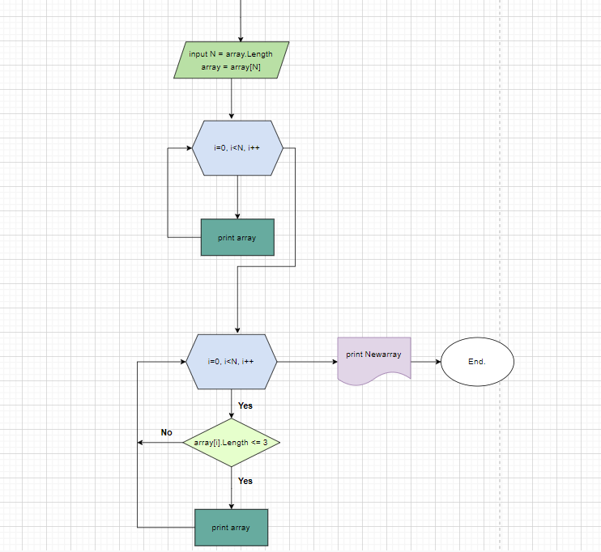

# Итоговая работа 1-го блока #

## Описание решения контрольной задачи

1. Через консоль задаём число элементов в массиве;
2. В методе через цикл вводим строки, пока число строк не станет равно присвоеному числу элементов массиве;
3. Вывод массива введенных строк;
4. В методе через цикл выполняем проверку условия (число элементов в стоке <=3);
5. Вывод массива проверенных строк.

## Блок-схема решения контрольной задачи
